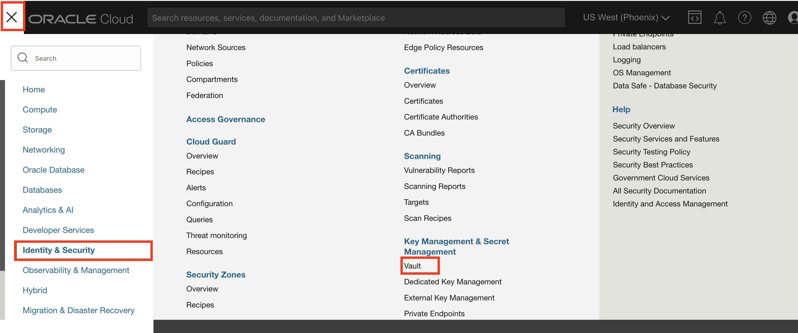
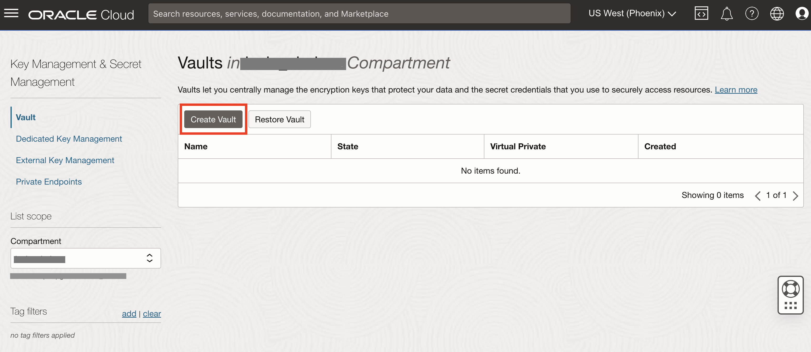

# Provision an OCI Vault

## Introduction

This lab describes the steps to create a new OCI Vault.

Estimated Lab Time: 10 minutes

### Objectives

In this lab, you will:

* Create an OCI Vault
* Create OCI Vault Master Encryption Key

## Task 1: Create an OCI Vault

1. From the Oracle Cloud Console, open the navigation menu, click **Identity & Security**, and then click **Vault**.

   

2. Under **List scope**, select the compartment in which you want to create the vault.

   

3. Click **Create Vault**.

   

4. In the **Create Vault** dialog box, provide the following details:

      ```
      Create in Compartment: <your compartment>

      Name: shared-vault

      Make it a virtual private vault: NO (LEAVE THE BOX UNCHECKED)
      ```

      >Note: You cannot change the vault type after the vault is created.

5. Click **Crete Vault**

6. View the **Vault** details. Copy **OCID**, you will need it in the configuring application lab.

## Task 2: Create OCI Vault Master Encryption Key

1. In the **Vault** you created, navigate to **Master Encryption Key**, click **Create Key**.

2. Provide the following details:

      ```text
      Protection Mode: Software

      Name: master-key

      Key Shape Algorithm: AES (Symmetric key for Encrypt and Decrypt)

      Key Shape Length: 256 bits

      Import External key: NO (LEAVE THE BOX UNCHECKED)
      ```

3. Click **Create Key**.

Congratulations! In this lab, you created a new OCI Vault with Master Encryption Key in your workshop compartment.

You may now **proceed to the next lab**.

## Acknowledgements

* **Author** - [](var:author)
* **Contributors** - [](var:contributors)
* **Last Updated By/Date** - [](var:last_updated)
